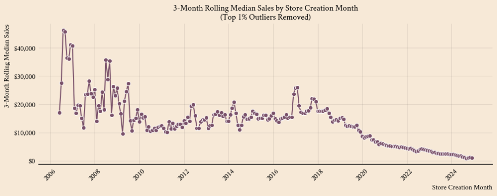
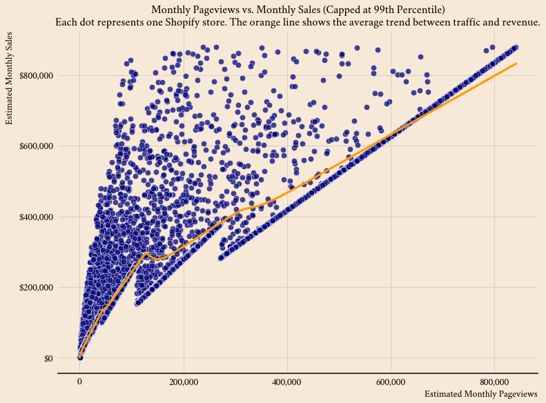
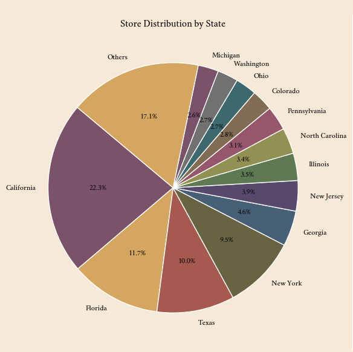
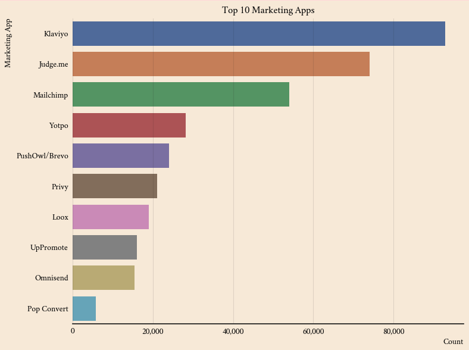
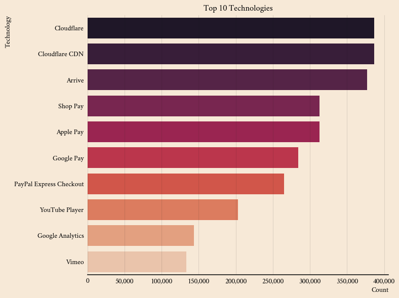

# 🛍️ Shopify Dashboard

This project visualizes trends from a dataset of **1 million Shopify stores**, using Python, Seaborn, and MoreThemes.  
It explores how traffic, technology stacks, and store creation timelines affect performance across the platform.

---

## 📊 Visual Highlights

### 1️⃣ Median Monthly Sales Over Time (2006–2024)

This line chart shows the **3-month rolling median monthly sales** based on store creation date.  
It excludes the top 1% of outliers to focus on typical store performance.

📉 Key Trend: Newer stores earn significantly less than earlier ones.

---

### 2️⃣ Pageviews vs. Monthly Sales (Performance Scatter)

📈 Some stores with similar traffic convert far better than others, highlighting the gap in optimization and business models.

---

### 3️⃣ Store Distribution by State

---

### 4️⃣ Top 10 Marketing Apps

This bar chart shows the top marketing tools installed by Shopify stores.  

🔥 Klaviyo dominates the field with 92,802 clients, followed closely by Judge.me and Mailchimp.

---

### 5️⃣ Top 10 Technologies Used by Shopify Stores

Ranks the most common technologies in Shopify stacks — including payment processors, analytics, and CDNs.

---

## 🧰 Tools Used

- **SQL** – Used to clean, filter, and structure the raw dataset prior to analysis
- **Python 3**
- **Pandas**, **Matplotlib**, **Seaborn**, **MoreThemes**
- Dataset: Proprietary data scraped from StoreLeads.io (not publicly available)

---

